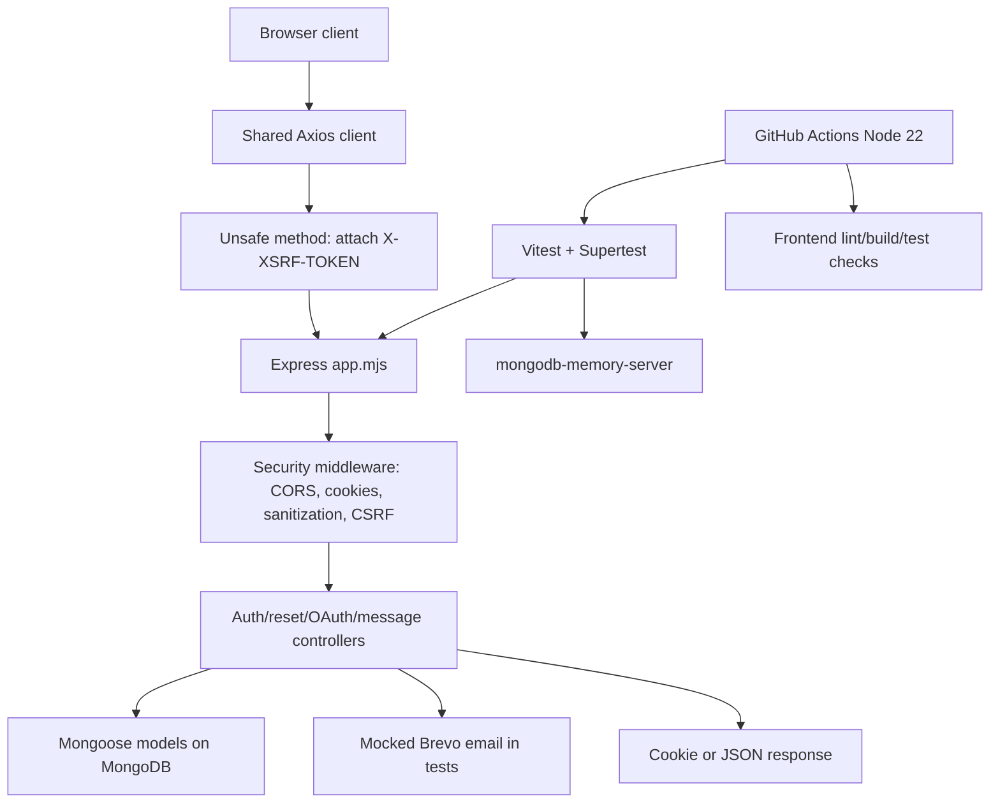

# Phase 1: Security And Test Foundation - Research

**Researched:** 2026-06-08
**Domain:** Express security hardening, MERN auth tests, CSRF, CI verification
**Confidence:** HIGH

<user_constraints>
## User Constraints

### Locked Decisions
- Use `Backend/Chatify/test/` with `setup`, `fixtures`, and route test suites.
- Test HTTP behavior by importing `Backend/Chatify/app.mjs`; do not start `Backend/Chatify/server.mjs`.
- Use Vitest, Supertest, and `mongodb-memory-server` with real Mongoose models and mocked external services.
- Keep Phase 1 message authorization coverage at HTTP route boundaries.
- Implement signed double-submit CSRF with readable cookie plus `X-XSRF-TOKEN` header.
- Do not build active CSRF enforcement on `csurf`.
- Exempt only read-only GET routes, `GET /api/csrf-token`, and OAuth GET initiators/callbacks.
- Attach CSRF headers in `Frontend/Chatify/src/api/axios.ts`.
- Expired or invalid access tokens return 401 and clear frontend auth state; do not add persisted refresh tokens in Phase 1.
- Store reset codes with HMAC-SHA256 and `PASSWORD_RESET_SECRET`; allow 5 failed attempts and delete used records.
- Use a strict frontend origin allowlist for OAuth callbacks and ignore user-provided redirect targets.
- Replace sensitive direct logs with small local redaction helpers.
- Add GitHub Actions for backend tests plus frontend lint/build using Node 22.
- Keep the roadmap's 3-plan split.
- Inspect `Backend/Chatify/profile.json` and remove or ignore it if generated profile data.
- Do not edit `Frontend/Chatify/src/pages/chat/chat.tsx`.

### Agent Discretion
- Exact test file names under `Backend/Chatify/test/`.
- Whether the sensitive log gate is a Vitest test or npm script.
- Whether unused `csurf` is removed immediately or left unused after active replacement.

### Deferred Ideas
- Socket.IO identity, room membership, socket event authorization, reconnect reconciliation, and socket tests.
- Canonical message lifecycle, unread reconciliation, edit/delete/reaction semantics, and pagination redesign.
- Chat UI reconstruction and edits to `Frontend/Chatify/src/pages/chat/chat.tsx`.
</user_constraints>

<architectural_responsibility_map>
## Architectural Responsibility Map

| Capability | Primary Tier | Secondary Tier | Rationale |
|------------|--------------|----------------|-----------|
| Backend HTTP security tests | API/Backend | Database/Storage | Route behavior is owned by Express controllers/middleware and persisted through Mongoose. |
| CSRF enforcement | API/Backend | Browser/Client | Server must reject unsafe requests; frontend must send the expected header. |
| Auth/session lifecycle | API/Backend | Browser/Client | Cookie creation and token verification are backend responsibilities; frontend handles retry/expired state. |
| Password reset safety | API/Backend | Database/Storage | Reset tokens are generated, hashed, verified, and expired on the backend with MongoDB records. |
| OAuth redirect safety | API/Backend | Browser/Client | Backend callback handlers choose redirect origins; frontend only receives success/failure state. |
| Redacted logging | API/Backend | Browser/Client | Sensitive logs exist in both backend auth/socket paths and frontend auth/reset paths. |
| CI verification | Repository automation | API/Backend, Browser/Client | GitHub Actions must run package-level checks from both app roots. |
</architectural_responsibility_map>

<research_summary>
## Summary

Phase 1 is a security foundation for a brownfield MERN app. The standard approach is to add deterministic HTTP integration tests first, then use those tests to pin cookie/session, CSRF, reset, OAuth redirect, and message authorization boundaries. Supertest can exercise the exported Express app directly without opening a real port, and `mongodb-memory-server` has documented Vitest integration through global setup or equivalent lifecycle hooks.

CSRF should follow the approved signed double-submit strategy, not the inactive `csurf` scaffold. OWASP recommends a signed double-submit cookie bound to session-specific data and compared with HMAC-safe validation. Express also formally deprecated `csurf` in 2025, which supports replacing it with project-local middleware aligned with Chatify's cookie/JWT architecture.

**Primary recommendation:** Implement tests and CI as the first plan, then enforce CSRF/session/reset/OAuth/env controls under that harness, then replace/redact logging and add an automated log-pattern gate.
</research_summary>

<standard_stack>
## Standard Stack

### Core
| Library | Version | Purpose | Why Standard |
|---------|---------|---------|--------------|
| Vitest | current 4.x docs; install backend compatible release | Node/ESM test runner | Native ESM support and `.test.`/`.spec.` discovery fit this backend. |
| Supertest | current maintained package | Express HTTP integration tests | Exercises an Express `app` function without manually binding a port. |
| mongodb-memory-server | current docs | Isolated MongoDB for route/model tests | Provides deterministic MongoDB state without local or production database dependencies. |
| GitHub Actions `actions/setup-node` | v6 docs | CI Node setup and npm install/test steps | Official action supports explicit Node 22 and npm cache dependency paths. |

### Supporting
| Library/Pattern | Purpose | When to Use |
|-----------------|---------|-------------|
| HMAC-SHA256 with Node `crypto` | CSRF and reset-code integrity | Use for signed CSRF tokens and reset-code storage. |
| Axios request interceptor | Shared CSRF header attachment | Use in `Frontend/Chatify/src/api/axios.ts`, not per page. |
| Local redaction helper | Safe operational logging | Use instead of adding a logging framework during this foundation phase. |

### Alternatives Considered
| Instead of | Could Use | Tradeoff |
|------------|-----------|----------|
| Signed local CSRF helper | `csurf` | `csurf` is deprecated and currently inactive in this app. |
| Real MongoDB in tests | Developer local MongoDB | Faster to wire but non-deterministic and requires local secrets. |
| Full refresh-token persistence | Refresh token collection and rotation | Safer long-term, but explicitly out of scope for Phase 1. |
</standard_stack>

<architecture_patterns>
## Architecture Patterns

### System Architecture Diagram



### Recommended Project Structure

```text
Backend/Chatify/
  vitest.config.mjs
  test/
    setup/
      env.mjs
      mongo.mjs
      app.mjs
    fixtures/
      users.mjs
      chats.mjs
      messages.mjs
    helpers/
      authAgent.mjs
      csrf.mjs
    auth/
      auth.lifecycle.test.mjs
      reset.security.test.mjs
      oauth.redirect.test.mjs
    message/
      message.authorization.test.mjs
    security/
      csrf.test.mjs
      sensitive-logs.test.mjs
```

### Pattern 1: HTTP tests import the Express app
**What:** Use Supertest against `Backend/Chatify/app.mjs`.
**When to use:** Route, middleware, auth cookie, CSRF, and message authorization behavior.
**Source:** Supertest docs describe passing an Express app/function to `request()`.

### Pattern 2: Memory Mongo per test run
**What:** Start a `MongoMemoryServer`, set `MONGODB_URL`, connect Mongoose, and clear collections between tests.
**When to use:** Any route test that exercises real Mongoose models.
**Source:** `mongodb-memory-server` docs show Vitest global setup providing a memory Mongo URI.

### Pattern 3: Signed double-submit CSRF
**What:** Server issues a non-HttpOnly CSRF cookie containing `hmac.random`; unsafe requests must echo it in `X-XSRF-TOKEN`; server recomputes HMAC using session-specific data and a secret.
**When to use:** Cookie-authenticated REST mutations in a stateless JWT app.
**Source:** OWASP CSRF Prevention Cheat Sheet recommends signed double-submit cookies tied to session-specific data.
</architecture_patterns>

<dont_hand_roll>
## Don't Hand-Roll

| Problem | Don't Build | Use Instead | Why |
|---------|-------------|-------------|-----|
| HTTP request simulation | Manual `http.Server` lifecycle in every test | Supertest on `app.mjs` | Avoids port collisions and mirrors controller/middleware behavior. |
| Test database lifecycle | Local MongoDB assumptions | `mongodb-memory-server` | Keeps tests isolated from local `.env` and production data. |
| JWT crypto primitives | Custom token parsing/signing | Existing `jsonwebtoken` plus tests | The app already depends on it; Phase 1 should correct lifecycle behavior, not replace JWT stack. |
| CSRF token validation | Naive cookie equality check | HMAC signed double-submit token | OWASP flags session binding as the important protection against cookie injection. |
| Logging framework migration | Full logger/observability stack | Small redaction helpers | Scope is to stop leaks now; observability expansion can follow later. |
</dont_hand_roll>

<common_pitfalls>
## Common Pitfalls

### Pitfall 1: Import order hides test env changes
**What goes wrong:** `app.mjs` and config modules read env vars before tests set them.
**How to avoid:** Test setup must set `NODE_ENV`, `MONGODB_URL`, `SECRET_JWT_KEY`, `PASSWORD_RESET_SECRET`, and frontend origins before dynamically importing `app.mjs`.
**Warning signs:** Tests hit real MongoDB, real Brevo, or inconsistent cookie options.

### Pitfall 2: CSRF breaks login/bootstrap
**What goes wrong:** Unsafe auth endpoints require CSRF before the browser has fetched a token.
**How to avoid:** Keep `GET /api/csrf-token` public, have frontend initialize/refetch the CSRF cookie/header through shared Axios code, and test login/reset/logout with valid and missing tokens.
**Warning signs:** Auth tests pass only when CSRF is disabled or routes are broadly exempted.

### Pitfall 3: Log gates overmatch harmless strings or miss real leaks
**What goes wrong:** Regex scan either blocks normal code comments or misses token previews/emails.
**How to avoid:** Scope the scan to auth/reset/token/frontend logging paths and define explicit forbidden patterns such as token previews, raw email logs, reset code logs, cookie option dumps, and committed OAuth profile artifacts.
**Warning signs:** Developers bypass the gate or sensitive console calls remain in auth paths.
</common_pitfalls>

<sota_updates>
## State of the Art

| Old Approach | Current Approach | When Changed | Impact |
|--------------|------------------|--------------|--------|
| `csurf` middleware as default Express CSRF answer | Architecture-specific CSRF protection or maintained alternatives | Express deprecated `csurf` in May 2025 | Chatify should replace active enforcement with local signed middleware. |
| Unspecified CI Node version | Explicit `actions/setup-node` version | setup-node docs recommend specifying version | Phase uses Node 22 consistently. |
| Local database-backed tests | Memory database per test run | Established testing pattern | Avoids real secrets and cross-test contamination. |
</sota_updates>

<sources>
## Sources

### Primary
- https://vitest.dev/guide/ - Vitest install, file naming, `vitest run`, and config behavior.
- https://github.com/forwardemail/supertest - Supertest Express app/function request pattern.
- https://typegoose.github.io/mongodb-memory-server/docs/guides/integration-examples/test-runners/ - Vitest integration with memory Mongo.
- https://cheatsheetseries.owasp.org/cheatsheets/Cross-Site_Request_Forgery_Prevention_Cheat_Sheet.html - signed double-submit and HMAC CSRF guidance.
- https://expressjs.com/en/blog/2025-05-16-express-cleanup-legacy-packages/ - Express deprecation of `csurf`.
- https://github.com/actions/setup-node - GitHub Actions Node setup and cache dependency path guidance.

### Skill Discovery
- `antfu/skills@vitest` - selected for Vitest test-writing guidance.
- `aj-geddes/useful-ai-prompts@csrf-protection` - selected for CSRF implementation checklists.
- `aj-geddes/useful-ai-prompts@session-management` - selected for session lifecycle checklists.

### Local Codebase Evidence
- `.planning/phases/01-security-and-test-foundation/01-SPEC.md`
- `.planning/phases/01-security-and-test-foundation/01-CONTEXT.md`
- `.planning/codebase/TESTING.md`
- `.planning/codebase/CONCERNS.md`
- `Backend/Chatify/app.mjs`
- `Frontend/Chatify/src/api/axios.ts`
</sources>

<metadata>
## Metadata

**Research scope:**
- Core technology: Express 5, React/Vite, MongoDB/Mongoose, cookie auth.
- Ecosystem: Vitest, Supertest, mongodb-memory-server, GitHub Actions.
- Patterns: signed CSRF, in-memory integration tests, redacted logging gates.
- Pitfalls: import order, broad CSRF exemptions, sensitive log leakage, ignored workflow files.

**Confidence breakdown:**
- Standard stack: HIGH - verified against official docs and project decisions.
- Architecture: HIGH - maps directly to current repo structure.
- Pitfalls: HIGH - observed in local code and accepted discussion decisions.
- Code examples: MEDIUM - examples are represented as plan guidance, not copied into implementation.

**Valid until:** 2026-07-08 for planning purposes; package versions should be checked during implementation.
</metadata>

---

*Phase: 01-security-and-test-foundation*
*Research completed: 2026-06-08*
*Ready for planning: yes*
