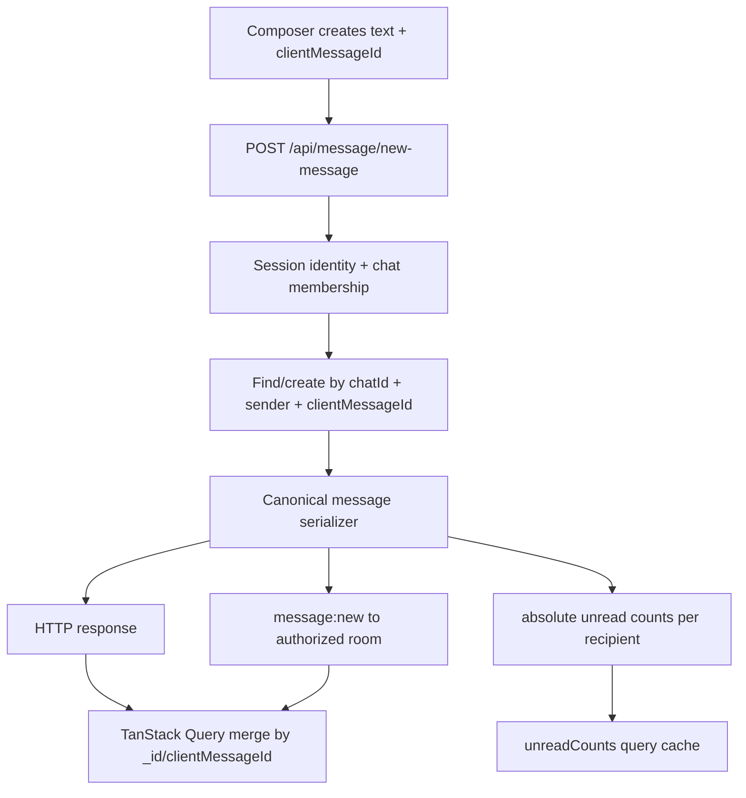

# Phase 3: Canonical Message State - Research

**Researched:** 2026-06-08
**Domain:** MERN realtime message state, MongoDB persistence, Socket.IO event contracts, TanStack Query cache convergence
**Confidence:** HIGH

<user_constraints>
## User Constraints From CONTEXT.md

### Locked Decisions
- D-01 through D-03: Keep HTTP route modules thin, keep creation HTTP-only, and extract focused message-state helpers instead of expanding `messageController.mjs`.
- D-04 through D-09: Add optional message fields for `clientMessageId`, tombstone metadata, and idempotency indexes; duplicate create with changed content returns `409`; duplicate idempotent create must not re-emit side effects; frontend sends new `clientMessageId` values while backend accepts legacy absence.
- D-10 through D-14: Full canonical message payloads are required for message-bearing responses/events; read/delivery patches may stay compact; `sent -> delivered -> read` must be shared, ranked, guarded, and idempotent; socket delivery derives chat from persisted message.
- D-15 through D-19: `Message.readBy` plus authenticated user context is the unread source of truth; emit absolute unread counts after visibility changes; delete-for-self is available to visible chat members; delete-for-everyone is a stable tombstone; `getAllChats()` must project `latestMessage` per requesting user.
- D-20 through D-25: Keep the existing message-history route path but use cursor params; TanStack Query becomes the canonical frontend message store; shared helpers own upsert, patch, tombstone/remove, unread sync, and cursor prepend; failed optimistic sends remain visible with reusable `clientMessageId`.
- D-26 through D-28: Reaction validation uses max 32-character strings and max 50 reactions per message; private resource errors are generic; create/edit validation aligns at trimmed nonempty text and 1000 characters.
- D-29 through D-32: Add backend focused suites and minimal frontend Vitest pure-helper coverage; keep frontend lint/build; if a frontend test script is added it becomes blocking verification.
- D-33 through D-35: Edit the already-dirty `Frontend/Chatify/src/pages/chat/chat.tsx` only for minimal targeted wiring, never for layout cleanup, and inspect the diff before/after any such edit.

### Agent Discretion
- Exact backend helper names and placement can be chosen under `Backend/Chatify/Utils` or a focused message-domain module.
- Exact frontend helper names and module placement can be chosen near `useChatQueries.ts`, as long as TanStack Query remains the canonical store.
- Legacy `page` parameters may be tolerated during migration, but Phase 3 frontend code must use cursor pagination and backend must not rely on `skip` for the new path.

### Deferred Ideas
- Phase 4 owns chat page visual reconstruction, responsive polish, and component splitting.
- Phase 5 owns search, conversation continuity, and final account/session polish.
- v2 owns group expansion, attachments, push notifications, moderation, admin tooling, and end-to-end encryption.
- Horizontal Socket.IO scaling and Redis/shared presence state remain out of scope.
</user_constraints>

<architectural_responsibility_map>
## Architectural Responsibility Map

| Capability | Primary Tier | Secondary Tier | Rationale |
|------------|--------------|----------------|-----------|
| Idempotent message creation | API/Backend | Database/Storage | HTTP controller must derive sender from session and MongoDB must enforce uniqueness for sender/chat/clientMessageId. |
| Canonical message payload | API/Backend | Browser/Client | Backend serializer defines source of truth; frontend TypeScript mirrors the contract. |
| Delivery/read status lifecycle | API/Backend | Socket.IO runtime | Backend persistence owns monotonic transitions; sockets broadcast authorized patches. |
| Optimistic merge and failed sends | Browser/Client | API/Backend | TanStack Query owns visible state; backend idempotency makes retries safe. |
| Per-user unread counts | API/Backend | Browser/Client | MongoDB read-state queries produce absolute counts; frontend cache applies authoritative values. |
| Delete/edit/reaction visibility | API/Backend | Database/Storage | Membership, sender ownership, tombstones, and visibility filters are backend/domain concerns. |
| Cursor message history | API/Backend | Browser/Client | Backend provides stable cursor slices; frontend prepends without duplicate local ownership. |
| Regression evidence | Test Infrastructure | API/Backend and Browser/Client | Backend Vitest/Supertest/socket tests and frontend pure-helper Vitest tests are blocking. |
</architectural_responsibility_map>

<research_summary>
## Summary

Phase 3 should treat message state as a domain contract, not a set of ad hoc controller and hook patches. The existing code already has a useful foundation from Phase 2: authenticated Socket.IO handshakes, membership helpers, targeted user emits, backend Vitest with MongoDB Memory Server, Supertest agents, and real Socket.IO client tests. The gaps are concentrated around message identity, duplicate handling, visibility filters, canonical payloads, unread derivation, and cache ownership.

The recommended architecture is a small backend message-state layer with canonical serializers, visibility predicates, unread counters, idempotent creation, ranked status transitions, and cursor query helpers. MongoDB should enforce the idempotency invariant with a partial unique index on `(chatId, sender, clientMessageId)` and use cursor-friendly `(chatId, createdAt, _id)` indexes. Frontend state should move durable message ownership into TanStack Query, with pure helper functions for merge, patch, tombstone/remove, failed optimistic state, unread-map updates, and cursor prepends. Socket events should call those helpers and stop owning separate merge rules.

**Primary recommendation:** Implement Phase 3 as three sequential waves: backend canonical state primitives and tests, frontend canonical cache convergence and tests, then cursor history plus validation alignment and final verification.
</research_summary>

<standard_stack>
## Standard Stack

| Library/Tool | Version In Repo | Purpose | Recommendation |
|--------------|-----------------|---------|----------------|
| Mongoose | `^8.16.4` | Message/chat persistence and indexes | Keep it; add schema fields, validation, partial unique index, and cursor indexes in the existing model. |
| MongoDB Memory Server | `^11.2.0` | Isolated backend integration tests | Reuse existing backend test setup for idempotency, visibility, unread, and cursor coverage. |
| Vitest | backend `^4.1.8` | Backend tests | Keep backend harness and add focused message suites. Add frontend Vitest only for pure helper tests. |
| Supertest | `^7.2.2` | Authenticated HTTP route tests | Reuse `signupWithAgent()` for message route verification. |
| Socket.IO / Client | `^4.8.x` | Realtime delivery and event tests | Keep real socket client tests for event contracts and targeted unread updates. |
| TanStack Query | `^5.90.4` | Frontend server-state cache | Make it the canonical message store; avoid durable local `useState` mirrors. |

No broad replacement is recommended. The installed/reused skills support this approach: `mongodb`, `tanstack-query`, `vitest-testing`, and `websocket-engineer`.
</standard_stack>

<architecture_patterns>
## Architecture Patterns

### Message State Flow



### Backend Helper Pattern

Recommended backend helper responsibilities:
- `normalizeMessageText(text)`: trim, require nonempty, cap at 1000.
- `serializeMessage(message)`: return the canonical payload shape for HTTP and socket events.
- `buildVisibleMessageFilter({ chatId, userId })`: exclude delete-for-self records and optionally include tombstones.
- `countUnreadMessages({ chatId, userId })`: derive absolute unread count from `Message.readBy`.
- `applyStatusTransition({ message, actorId, targetStatus })`: enforce ranked `sent -> delivered -> read` behavior without timestamp churn.
- `buildCursorQuery({ chatId, userId, before, limit })`: fetch stable `createdAt` plus `_id` slices.

### MongoDB Idempotency Pattern

Use an optional `clientMessageId` with a partial unique index:

```js
messageSchema.index(
  { chatId: 1, sender: 1, clientMessageId: 1 },
  {
    unique: true,
    partialFilterExpression: { clientMessageId: { $exists: true, $type: 'string' } },
  }
)
```

Recommendation: handle duplicate key races by reloading the existing message, comparing normalized text, returning the existing canonical message for identical retry, and returning `409 conflict` for changed content. The duplicate path must not emit `message:new` or unread updates.

### TanStack Query Cache Pattern

Use pure helper functions and call them from mutations and socket listeners:
- `upsertCanonicalMessage(data, message)` matches by `_id` first, then `clientMessageId`.
- `patchMessageStatus(data, patch)` applies ranked status patches.
- `applyMessageTombstone(data, message)` replaces content with server tombstone rather than removing stable ids.
- `markOptimisticFailed(data, clientMessageId)` keeps failed messages visible without restoring stale snapshots.
- `prependCursorPage(data, page)` dedupes by `_id` and `clientMessageId`, then sorts by `createdAt` plus `_id`.

Recommendation: preserve the public shape returned by `useMessages()` where possible so `chat.tsx` integration stays minimal.

### Anti-Patterns To Avoid

- Snapshot rollback that restores the entire pre-mutation message list. It can delete concurrent socket messages received after the optimistic insert.
- Relative unread increments as the canonical unread contract. They are acceptable as legacy compatibility only; Phase 3 should prefer absolute counts.
- Hard delete-for-everyone. It breaks stable ids, cursor windows, socket dedupe, and clients holding the deleted `_id`.
- Page/skip history for large message lists. It becomes unstable under insertion/deletion and grows expensive with depth.
- Controller-specific status checks. A shared ranked helper is required so delivery/read cannot drift across HTTP and socket paths.
</architecture_patterns>

<live_code_findings>
## Live Code Findings

### Backend
- `Backend/Chatify/Controller/messageController.mjs` creates messages without `clientMessageId`, increments `Chats.unReadMessages`, emits relative unread increments, uses page/skip pagination, does not filter `deletedFor`, hard-deletes for everyone, emits partial edit/delete/reaction payloads, and duplicates read/status logic across paths.
- `Backend/Chatify/Models/messageModel.mjs` has `maxlength: 5000` while controller create uses 1000. It lacks `clientMessageId`, `deletedForEveryone`, `deletedBy`, `deletedAt`, idempotency indexes, and cursor tie-breaker indexes.
- `Backend/Chatify/Config/socket.mjs` already derives socket identity from cookies and derives delivery chat membership from persisted messages, but delivery status changes are still local to socket code and need the shared ranked helper.
- `Backend/Chatify/Controller/chatController.mjs` populates `latestMessage` directly, so messages deleted for the requesting user can still appear in the sidebar.

### Frontend
- `Frontend/Chatify/src/hooks/useChatQueries.ts` mirrors query data into local `useState`, creates optimistic ids with `Date.now()`, sends a client-supplied `sender`, replaces optimistic messages only by temporary `_id`, and restores whole snapshots on failed sends.
- `Frontend/Chatify/src/api/messageApi.ts` still sends `{ chatId, text, sender }` and fetches `page`/`limit` history.
- `Frontend/Chatify/src/types/chat.ts` lacks `clientMessageId`, tombstone metadata, failed optimistic status, cursor metadata, and absolute-only unread event typing.
- `Frontend/Chatify/src/hooks/useChatSocket.ts` receives relevant socket events but delegates message merge behavior back to page callbacks and applies unread updates with relative increments.
- `Frontend/Chatify/src/pages/chat/chat.tsx` is already dirty and should be treated as a narrow integration surface only.

### Tests
- Backend now has Vitest, MongoDB Memory Server, Supertest, socket helpers, message fixtures, and authorization tests. The older `TESTING.md` is stale on this point.
- Frontend has lint/build scripts but no frontend test runner. Phase 3 should add a minimal Vitest setup for pure helper tests rather than a full DOM testing stack.
</live_code_findings>

<validation_architecture>
## Validation Architecture

### Sampling Strategy

Phase 3 needs automated sampling at every state boundary:
- Backend HTTP route tests for idempotent create, validation, authorization, read/unread, delete/edit/reaction, and cursor pagination.
- Backend Socket.IO integration tests for canonical `message:new`, status patch emissions, read-batch patches, tombstones/reactions, and targeted absolute unread updates.
- Frontend pure Vitest tests for merge by `_id` and `clientMessageId`, socket-before-HTTP success, failed optimistic retry, unread-map sync, and cursor prepend dedupe.
- Frontend lint/build as blocking verification after TypeScript/API changes.

### Recommended Test Files

| Area | Test File | Primary Behaviors |
|------|-----------|-------------------|
| Idempotency | `Backend/Chatify/test/message/message.idempotency.test.mjs` | duplicate create, changed-content conflict, sender spoof rejection, no duplicate socket/unread side effects |
| Status/read/unread | `Backend/Chatify/test/message/message.status-unread.test.mjs` | monotonic delivery/read, sender cannot read own, absolute unread counts, delete-for-self filtering |
| Mutations | `Backend/Chatify/test/message/message.mutations.test.mjs` | edit window, tombstone delete, reaction bounds/idempotency, private-resource errors |
| Cursor history | `Backend/Chatify/test/message/message.pagination.test.mjs` | first page, older cursor, tie-breaker, deleted filtering, max limit |
| Socket contract | `Backend/Chatify/test/socket/socket.message-state.test.mjs` | canonical events, targeted unread, status patches, duplicate no re-emit |
| Frontend cache | `Frontend/Chatify/src/hooks/messageCache.test.ts` or nearby | pure helper behavior for merge, failure, unread, cursor |

### Verification Commands

```powershell
cd Backend/Chatify; npm test -- test/message/message.idempotency.test.mjs
cd Backend/Chatify; npm test -- test/message/message.status-unread.test.mjs
cd Backend/Chatify; npm test -- test/message/message.mutations.test.mjs
cd Backend/Chatify; npm test -- test/message/message.pagination.test.mjs
cd Backend/Chatify; npm test -- test/socket/socket.message-state.test.mjs
cd Backend/Chatify; npm test
cd Frontend/Chatify; npm test -- --run
cd Frontend/Chatify; npm run lint
cd Frontend/Chatify; npm run build
```

### Validation Recommendation

Add backend tests alongside each backend change, add frontend Vitest before frontend helper implementation, and make the final plan rerun the full backend suite plus frontend test/lint/build. Manual verification should not be required for Phase 3 behavior.
</validation_architecture>

<plan_recommendation>
## Plan Recommendation

1. `03-01`: Define canonical message contracts and idempotent backend state transitions.
2. `03-02`: Rebuild frontend message merge, optimistic failure handling, and unread synchronization around TanStack Query.
3. `03-03`: Replace offset history behavior, align validation boundaries, and run final full verification.
</plan_recommendation>

---
*Phase: 03-canonical-message-state*
*Research complete: 2026-06-08*

